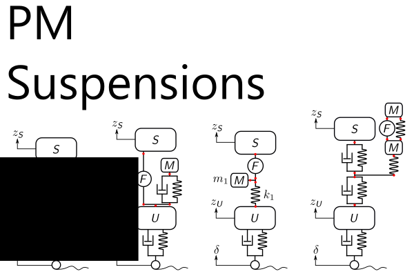

## README (pm-suspensions)

[](https://github.com/danielrherber/pm-suspensions/releases/latest)
[](https://www.mathworks.com/products/matlab.html)
[](https://github.com/danielrherber/pm-suspensions/issues)
[](https://github.com/danielrherber/pm-suspensions/graphs/contributors)

[](https://github.com/danielrherber/pm-suspensions/blob/master/License)

Explore vehicle suspension designs by solving a combined architecture, plant, and control problem.



---
### Install
* Download the [project files](https://github.com/danielrherber/pm-suspensions/archive/master.zip)
* Run [INSTALL_PMVS_project.m](https://github.com/danielrherber/pm-suspensions/blob/master/INSTALL_PMVS_project.m) in the MATLAB Command Window until no errors are seen
(*automatically adds project files to your MATLAB path, downloads the required files, and opens an example*)
```matlab
INSTALL_PMVS_project
```
* See [PMVSex_JMD.m](https://github.com/danielrherber/pm-suspensions/blob/master/examples/PMVSex_JMD.m) for an example
```matlab
open PMVSex_JMD
```

### Citation
Many elements of this project are discussed in the following papers. Please cite them if you use the project.

* DR Herber, JT Allison. **A problem class with combined architecture, plant, and control design applied to vehicle suspensions**. In ASME 2018 International Design Engineering Technical Conferences, DETC2018-86213, Quebec City, Canada, Aug. 2018. [[DOI]](https://doi.org/10.1115/DETC2018-86213) [[PDF]](https://systemdesign.illinois.edu/publications/Her18a.pdf)
	- *Abstract: Here we describe a problem class with combined architecture, plant, and control design for dynamic engineering systems. The design problem class is characterized by architectures comprised of linear physical elements and nested co-design optimization problems employing linear-quadratic dynamic optimization. The select problem class leverages a number of existing theory and tools and is particularly attractive due to the symbiosis between labeled graph representations of architectures, dynamic models constructed from linear physical elements, linear-quadratic dynamic optimization, and the nested co-design solution strategy. A vehicle suspension case study is investigated and a specifically constructed architecture, plant, and control design problem is described. The result was the automated generation and co-design problem evaluation of 4,374 unique suspension architectures. The results demonstrate that changes to the vehicle suspension architecture can result in improved performance, but at the cost of increased mechanical complexity. Furthermore, the case study highlights a number of challenges associated with finding solutions to the considered class of design problems.*
* DR Herber. **Advances in combined architecture, plant, and control design.** PhD Dissertation, University of Illinois at Urbana-Champaign, Urbana, IL, USA, Dec. 2017. [[URL]](http://hdl.handle.net/2142/99394) [[PDF]](https://systemdesign.illinois.edu/publications/Her17e.pdf#page=162)

### External Includes
See [INSTALL_PMVS_project](https://github.com/danielrherber/pm-suspensions/blob/master/INSTALL_PMVS_project.m) for more information
* **MATLAB File Exchange Submission IDs** (29312, 58799, 65434)
---
### General Information

#### Contributors
* [Daniel R. Herber](https://github.com/danielrherber) (primary)
* James T. Allison

#### Project Links
* [https://github.com/danielrherber/pm-suspensions](https://github.com/danielrherber/pm-suspensions)
<!-- * [http://www.mathworks.com/matlabcentral/fileexchange/58799](http://www.mathworks.com/matlabcentral/fileexchange/) -->